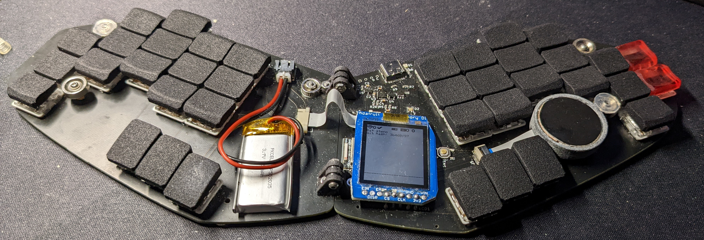

# Fusion

My travel board. Uses minimum spacing with choc mini (PG1232) and Cirque touchpad. It's meant to be folded for easy packing for traveling/going to classes.

TODO: more details

You can find the caps [here](https://github.com/crides/sqdg)
