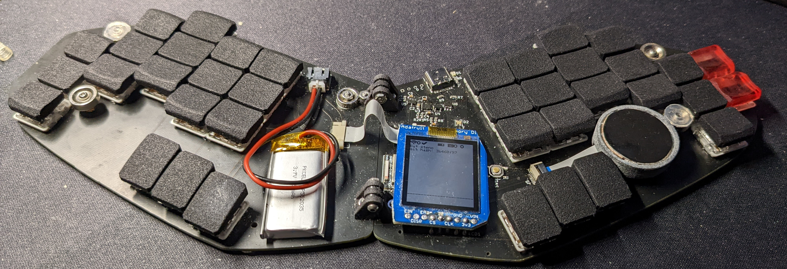
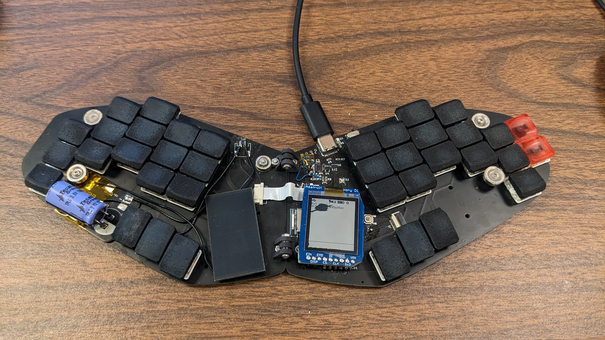
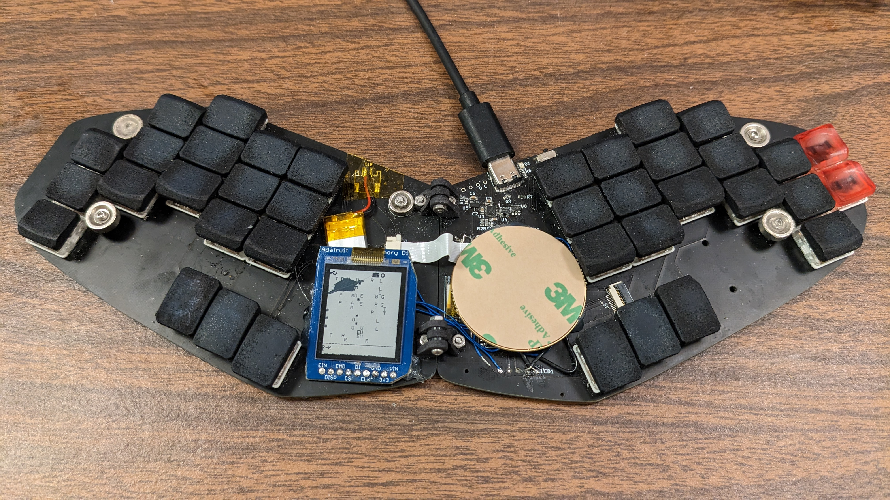
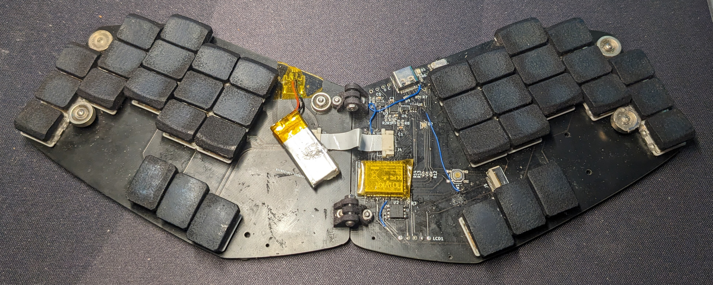

# Fusion

My travel board. Uses minimum spacing with choc mini (PG1232) and Cirque touchpad. It's meant to be folded for easy packing for traveling/going to classes. It's called fusion because the halves are now "fused" together (all my previous boards have been split).

The following picture shows how it's originally assembled:

You can find the caps [here](https://github.com/crides/sqdg). They are printed with the MJF Nylon process at JLCPCB.

The 2 extra pinky keys on the right side are different because I forgot about them when designing and printing the keycaps. Those keys are for steno, and like [the `fissure`](https://github.com/crides/fissure/) this includes [embedded stenograpy](https://github.com/crides/steno/).

The keymap is basically the same as [on the fissure](http://www.keyboard-layout-editor.com/#/gists/99409a249d886554bd60af15782b2d50) with a little difference in how the gaming and alternative layout layers are toggled.

One extra small feature it has is a PWM controlled RGB LED, which I use to display [LED widgets](https://github.com/zmkfirmware/zmk/issues/1003) on.

You can find a recent-ish configuration for this board [here](https://github.com/crides/zmk/tree/fusion-led-c-config/).

With the 350mAh battery on the board, this lasted me ~5 months of usage (it could've been even longer, the battery started out not on full charge (~3.8V)).

---

Here's the board after almost 11 months of usage (right before 2023):

Main differences:
- The trackpad is in a really weird spot. I knew this in the design phase, but didn't have much idea of how to fix it. So it's taken out. 
- A solar charging circuit with a Li-ion supercapacitor is added, replacing the battery and its charging circuit. The current supercap is 150F (!), which is equivalent to about 40mAh. This was to be done on another version of the board, but a small test circuit was fabbed instead, and that was used here with a fair amount of bodging. Now I can say the fusion board is (well can be) powered by fusion! (a.k.a. solar powered)
- There's a crack on the screen. The adhesive I used didn't cover the whole screen area, and once I pressed on the top left corner too hard, where the adhesive also didn't cover and left some empty space, and it cracked :(.

---

Here it is after 1 year:

Somehow the supercap doesn't seem to do well with the cold, so I swapped to the old small battery. Tried out a larger Cirque touchpad, by basically shifting the screen to the left side though a bunch of wires.

---

Here's what it looks like after 16 months:

The screen's completely broken, with the ribbon cable half "cut" (no idea how that happened). The trackpad location is better, but still pretty useless for my use cases (I use it 95% on top of my laptop keyboard most of the time, and the touchpad is right there, with more ready-to-be-used gestures. So touchpads and solar panels are gone. Nothing interesting to see here...
